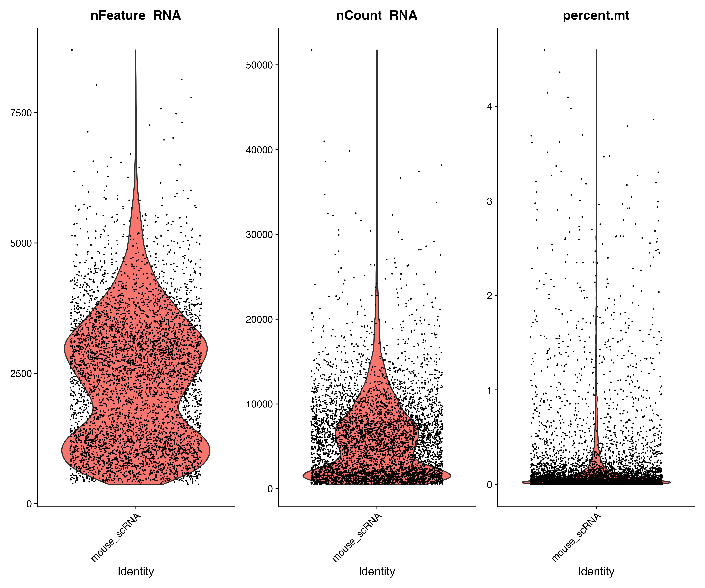
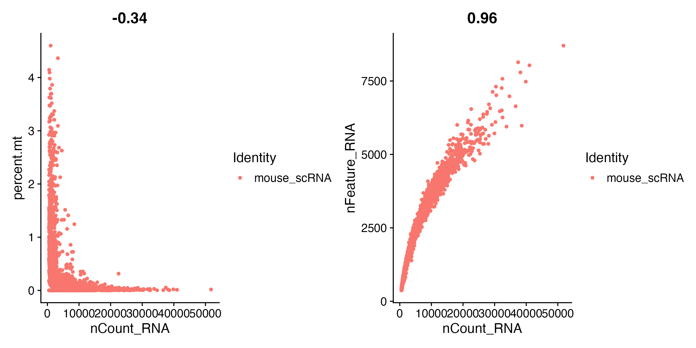
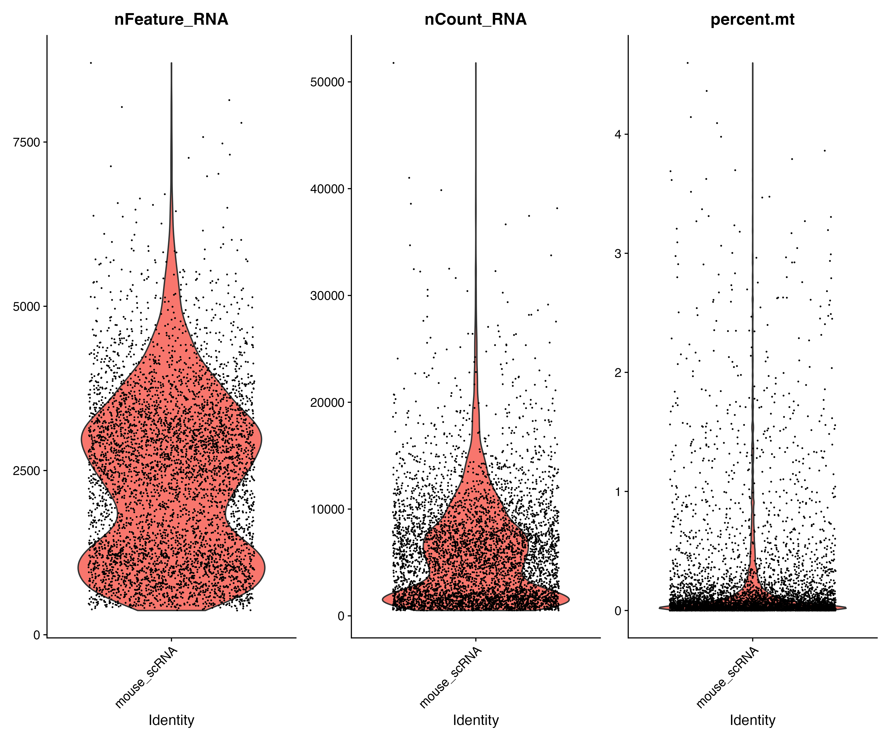
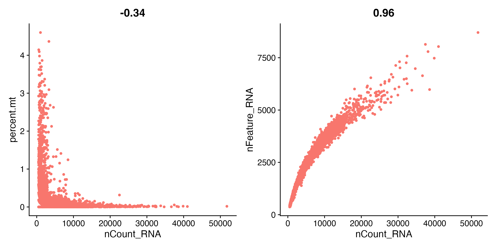

# Quality Control (QC)

Before continuing with downstream analysis, we need to assess the quality of the individual cells in our dataset. **Quality control (QC)** helps us identify cells that may contain too little RNA, have unusually high RNA content, or show signs of cellular stress or damage.

There are three commonly used QC metrics in Seurat:

- **`nCount_RNA`** — the total number of UMIs detected in each cell. This provides an indication of the overall amount of RNA captured from a cell.
- **`nFeature_RNA`** — the number of genes detected in each cell. Cells with very few detected genes may be low-quality cells.
- **`percent.mt`** — the percentage of transcripts originating from mitochondrial genes. A high mitochondrial percentage can indicate stressed or damaged cells.

These metrics should be considered together rather than using a single metric to determine whether a cell is good or bad. For example, a cell with very few detected genes may be a low-quality cell, while a cell with an unusually high number of genes and UMIs may potentially contain more than one cell (**a doublet**).

Importantly, QC thresholds are **dataset-dependent**. The appropriate thresholds can vary depending on the tissue, sample quality, sequencing depth, and experimental protocol. Therefore, we first visualise the QC metrics before deciding which cells to remove.

---

## Calculating Mitochondrial RNA Percentage

For our QC analysis, we need to calculate the percentage of RNA originating from mitochondrial genes.

The naming convention for mitochondrial genes differs between species. Human mitochondrial genes commonly begin with `MT-`, whereas mouse mitochondrial genes commonly begin with `mt-`. Since this tutorial uses a **mouse sample**, we first check the gene names in our dataset.

```r
head(grep("^mt-", rownames(query), value = TRUE))
```

**Output:**

```text
[1] "mt-Nd1"  "mt-Nd2"  "mt-Co1"  "mt-Co2"  "mt-Atp8" "mt-Atp6"
```

The dataset uses the `mt-` naming convention for mitochondrial genes.

We therefore calculate mitochondrial percentage using:

```r
# =============================================================================
# QUALITY CONTROL (QC)
# =============================================================================

# Calculate mitochondrial percentage
query[["percent.mt"]] <- PercentageFeatureSet(
  query,
  pattern = "^mt-"
)

# Inspect the calculated metadata
head(query[[]], 5)
```

**Output:**

| Cell | orig.ident | nCount_RNA | nFeature_RNA | percent.mt |
|---|---|---:|---:|---:|
|AAACCCAAGGCGATAC-1 | mouse_scRNA | 8017 | 3172 | 0.02494699|
|AAACCCAAGGGTGAGG-1 | mouse_scRNA | 9287 | 3151 | 0.07537418|
|AAACCCAAGTGCAGGT-1 | mouse_scRNA | 6634 | 2643 | 0.03014772|
|AAACCCACAATTGTGC-1 | mouse_scRNA | 8478 | 3253 | 0.04718094|
|AAACCCAGTGATACAA-1 | mouse_scRNA | 806 | 572 | 0.24813896|

This adds a new column called **`percent.mt`** to the cell metadata. The value represents the percentage of each cell's detected RNA originating from mitochondrial genes.

> **Note:** Always check the mitochondrial gene naming convention in your dataset before calculating mitochondrial percentage. Using `^MT-` for a dataset whose mouse genes are named `mt-`, for example, would result in the mitochondrial percentage being calculated incorrectly.

---

# Visualize QC Metrics Before Filtering

Before removing any cells, we visualise the three QC metrics. This allows us to examine their distributions and make an informed decision about appropriate filtering thresholds.

## Violin Plots

```r
# =============================================================================
# VISUALIZE QC METRICS BEFORE FILTERING
# =============================================================================

vln_plot <- VlnPlot(
  query,
  features = c(
    "nFeature_RNA",
    "nCount_RNA",
    "percent.mt"
  ),
  ncol = 3
)

vln_plot

ggsave(
  filename = file.path(
    PLOTS_DIR,
    "pre_filter_violin_plot.png"
  ),
  plot = vln_plot,
  width = 12,
  height = 10,
  dpi = 300
)
```

> **Note:** Seurat may display the warning:
>
> `Default search for "data" layer in "RNA" assay yielded no results; utilizing "counts" layer instead.`
>
> This is expected at this stage because the RNA assay currently contains the raw `counts` layer and has not yet been normalized. Seurat therefore uses the available counts layer for the QC visualisation.

### Pre-filtering QC Violin Plot

The violin plots show the distribution of the three QC metrics across the cells before filtering.



The plot allows us to assess the distributions of:

1. Number of detected genes (`nFeature_RNA`)
2. Total UMI counts (`nCount_RNA`)
3. Mitochondrial percentage (`percent.mt`)

These distributions help guide the selection of QC thresholds.

---

## QC Scatter Plots

We can also examine relationships between the QC metrics using scatter plots.

```r
# -----------------------------------------------------------------------------
# QC scatter plots
# -----------------------------------------------------------------------------

plot1 <- FeatureScatter(
  query,
  feature1 = "nCount_RNA",
  feature2 = "percent.mt"
)

plot2 <- FeatureScatter(
  query,
  feature1 = "nCount_RNA",
  feature2 = "nFeature_RNA"
)

qc_scatter <- plot1 + plot2

qc_scatter

ggsave(
  filename = file.path(
    PLOTS_DIR,
    "pre_filter_feature_scatter.png"
  ),
  plot = qc_scatter,
  width = 15,
  height = 5,
  dpi = 300
)
```

The first plot shows the relationship between **total UMI counts and mitochondrial percentage**.

The second plot shows the relationship between **total UMI counts and the number of detected genes**.

These plots are useful for identifying unusual populations of cells and deciding where sensible filtering boundaries might lie.

### Pre-filtering QC Scatter Plots




---

# Filter Low-Quality Cells

After inspecting the QC distributions, we can apply QC thresholds to remove cells that fall outside our chosen range.

For this tutorial, we use:

- `nFeature_RNA > 200`
- `nFeature_RNA < 10000`
- `percent.mt < 5`

The filtering step is:

```r
# =============================================================================
# FILTER LOW-QUALITY CELLS
# =============================================================================

cells_before_qc <- ncol(query)

query <- subset(
  query,
  subset =
    nFeature_RNA > 200 &
    nFeature_RNA < 10000 &
    percent.mt < 5
)

cells_after_qc <- ncol(query)

cells_removed <- cells_before_qc - cells_after_qc

cat(
  "Cells before QC:", cells_before_qc, "\n",
  "Cells after QC:", cells_after_qc, "\n",
  "Cells removed:", cells_removed, "\n"
)
```

**Output:**

```text
Cells before QC: 5000
Cells after QC: 5000
Cells removed: 0
```

### QC Result

In this tutorial dataset, **5,000 cells were present before QC and 5,000 cells remained after applying the selected thresholds**.

Therefore:

- **Cells before QC:** 8,601
- **Cells after QC:** 8,598
- **Cells removed:** 3

This means that **3 of the 8,601 cells in this dataset exceeded the selected QC thresholds**. Those cells get filtered out and we continue the analysis with the remaining high-quality cells.

The `nFeature_RNA > 200` threshold removes cells with very few detected genes, which may represent low-quality or poorly captured cells.

The upper threshold of `nFeature_RNA < 10000` can help flag cells with unusually large numbers of detected genes. Such cells may potentially be **doublets**, where two cells have been captured together. However, this threshold **does not identify doublets with certainty**. Dedicated doublet-detection methods, such as `scDblFinder`, can be used for a more rigorous analysis.

Finally, `percent.mt < 5` removes cells with a high proportion of mitochondrial transcripts. High mitochondrial RNA can be associated with stressed or damaged cells. However, **5% is only a starting threshold** and may not be appropriate for every tissue or experimental protocol.

> **Important:** These thresholds are examples for this tutorial and should not be treated as universal biological cutoffs. In a real analysis, thresholds should be selected after inspecting the QC distributions and considering the characteristics of the specific dataset.

---

# QC After Filtering

After filtering, we visualise the same QC metrics again to confirm the effect of the filtering thresholds.

```r
# =============================================================================
# QC AFTER FILTERING
# =============================================================================

vln_filter <- VlnPlot(
  query,
  features = c(
    "nFeature_RNA",
    "nCount_RNA",
    "percent.mt"
  ),
  ncol = 3,
  pt.size = 0.001
)

vln_filter

ggsave(
  filename = file.path(
    PLOTS_DIR,
    "post_filter_violin_plot.png"
  ),
  plot = vln_filter,
  width = 12,
  height = 10,
  dpi = 300
)
```

> **Note:** The same Seurat warning about using the `counts` layer may appear here because normalization has not yet been performed. This does not indicate an error.

### Post-filtering QC Violin Plot



Because no cells were removed by the selected thresholds, the post-filtering distributions are expected to be essentially unchanged from the pre-filtering distributions.

---

## Post-filtering QC Scatter Plots

We can also regenerate the scatter plots after filtering.

```r
plot1 <- FeatureScatter(
  query,
  feature1 = "nCount_RNA",
  feature2 = "percent.mt"
) +
  theme(legend.position = "none")

plot2 <- FeatureScatter(
  query,
  feature1 = "nCount_RNA",
  feature2 = "nFeature_RNA"
) +
  theme(legend.position = "none")

filter_scatter <- plot1 + plot2

filter_scatter

ggsave(
  filename = file.path(
    PLOTS_DIR,
    "post_filter_feature_scatter.png"
  ),
  plot = filter_scatter,
  width = 15,
  height = 5,
  dpi = 300
)
```

### Post-filtering QC Scatter Plots



All images are also saved under the **image** folder.

Comparing the **pre-filtering** and **post-filtering** plots allows us to assess how the QC thresholds affected the dataset.

In this tutorial run, **no cells were removed**, so the distributions and relationships between the QC metrics remain unchanged.

At this point, we have:

- calculated the mitochondrial RNA percentage;
- confirmed the mouse mitochondrial gene naming convention;
- visualised QC metrics before filtering;
- applied the selected QC thresholds;
- confirmed that 5,000 cells remained after filtering; and
- visualised the QC metrics after filtering.

The resulting Seurat object is now ready for the next stage of the workflow: **normalization and identification of highly variable genes**.
