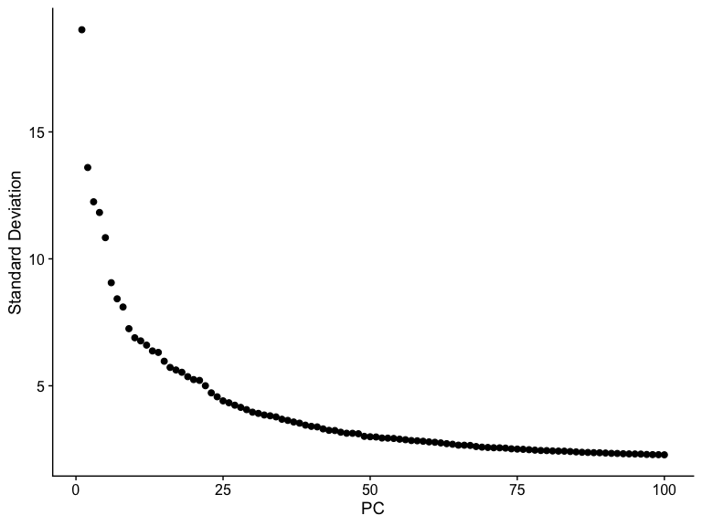
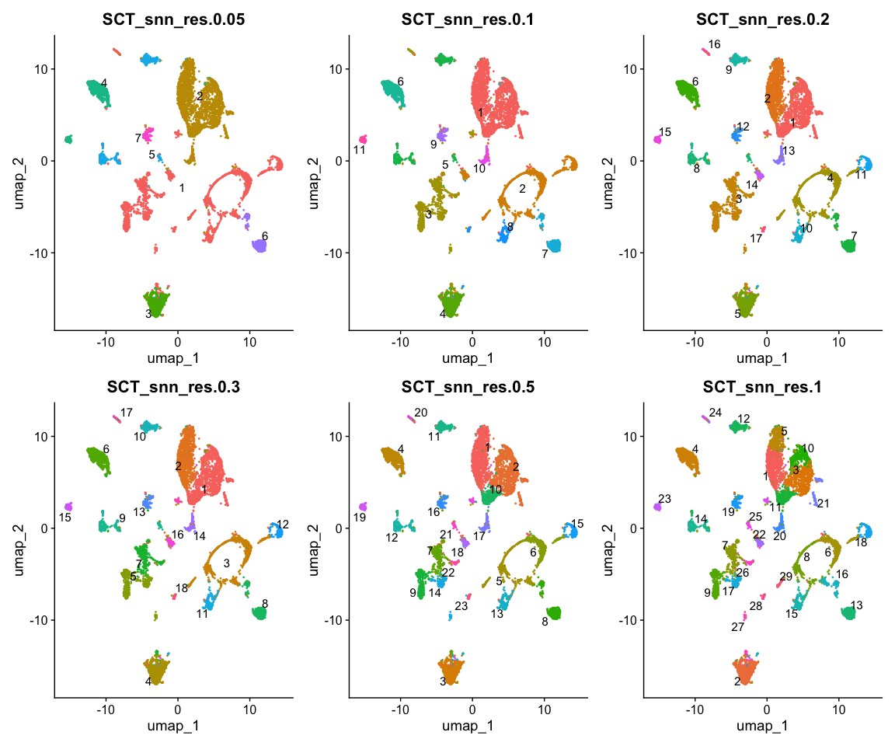
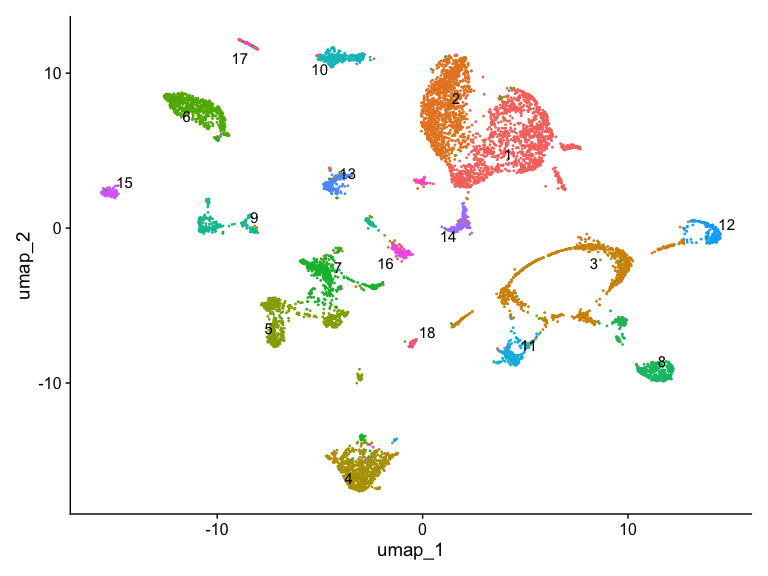
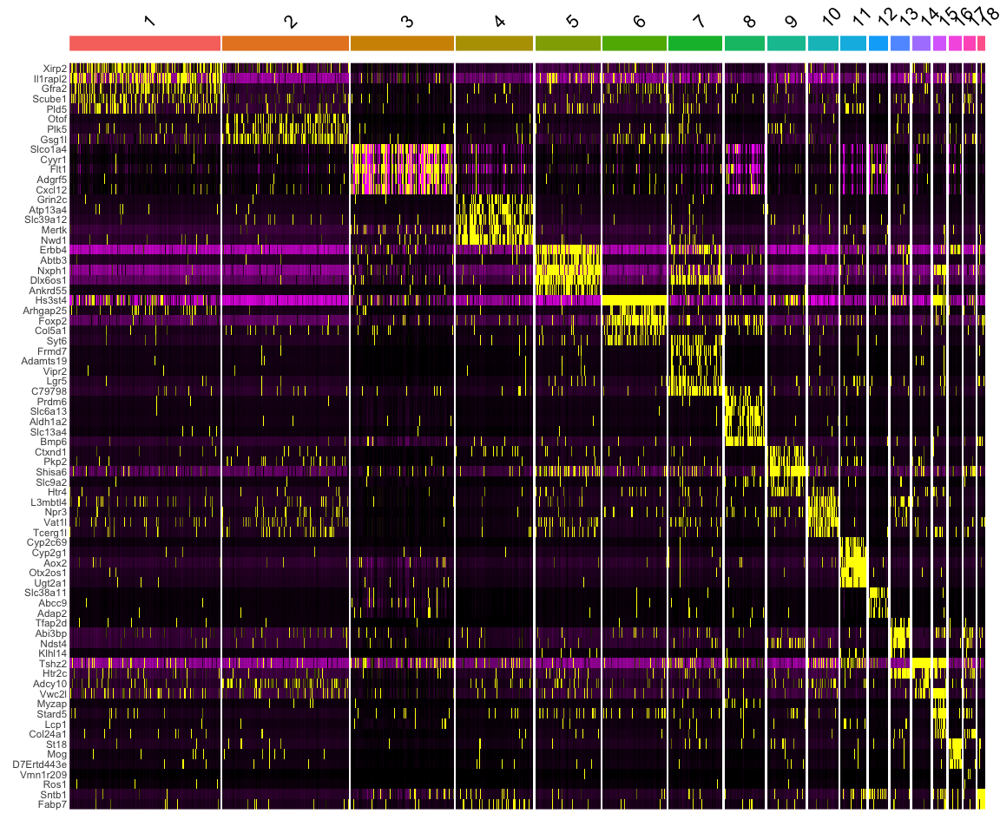
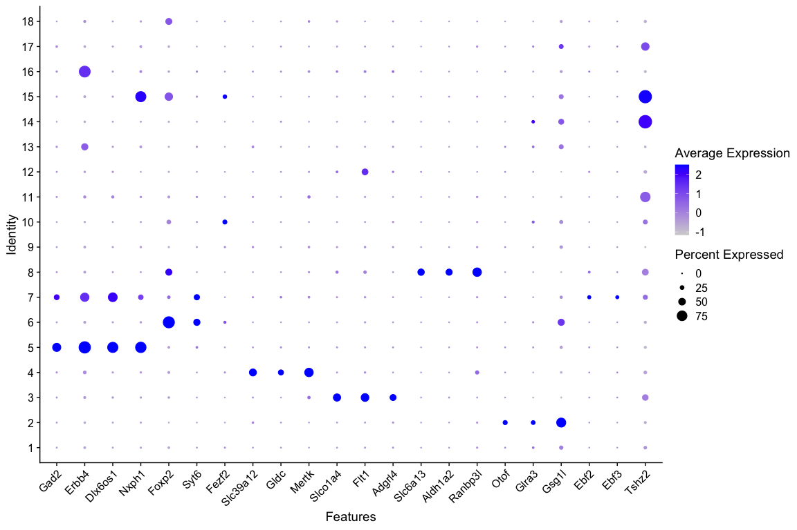
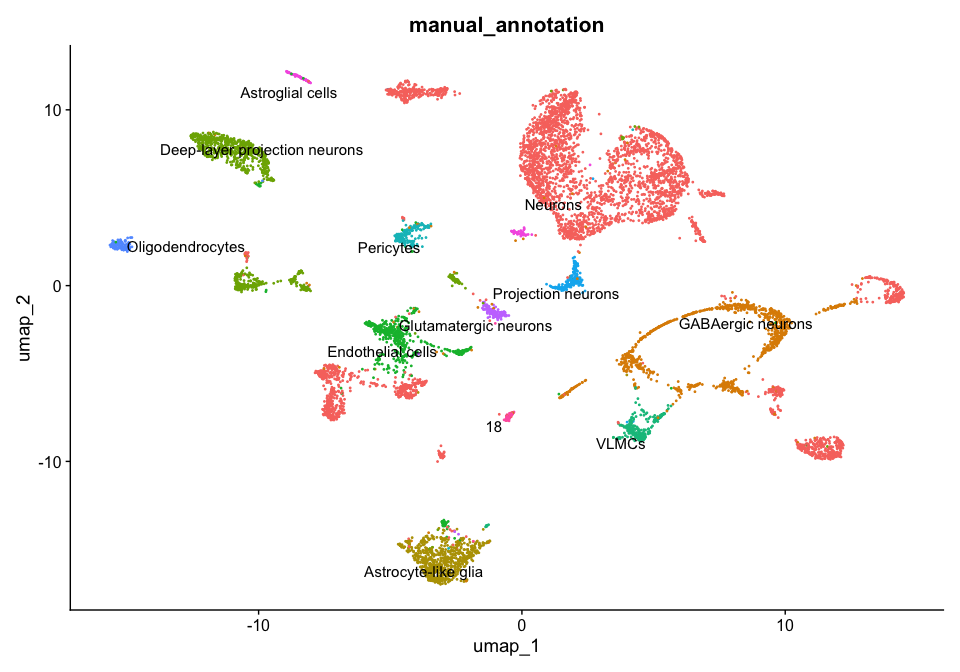
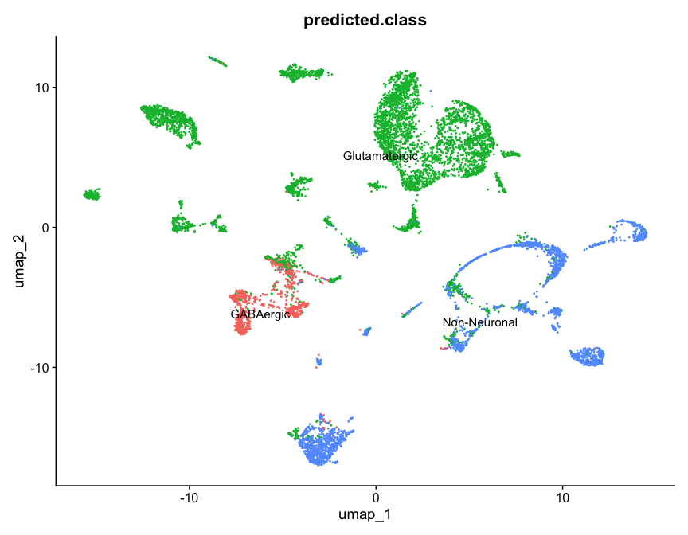
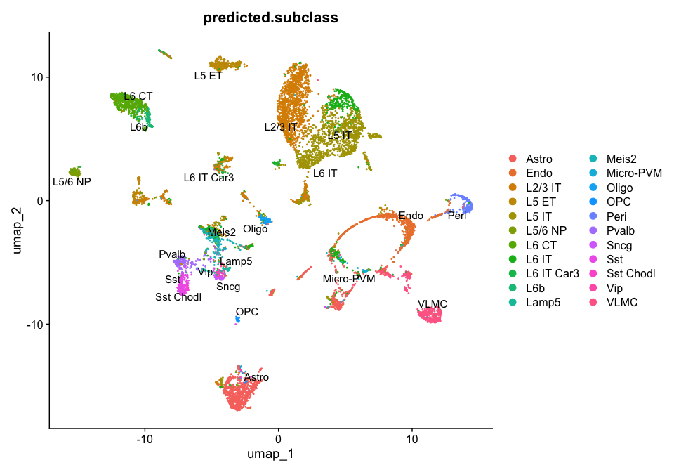
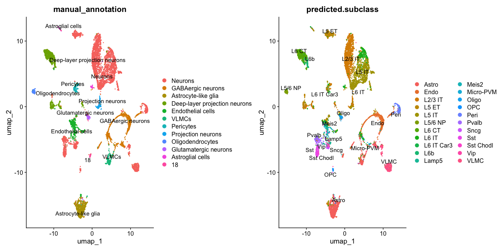

Clustering and annotation
================
Bismark Appiah, PhD.

- [1 Clustering and annotation](#1-clustering-and-annotation)
  - [1.1 Load required libraries](#11-load-required-libraries)
- [2 Loading the pre-processed data](#2-loading-the-pre-processed-data)
- [3 Selecting principal components for downstream
  analysis](#3-selecting-principal-components-for-downstream-analysis)
  - [3.1 Run PCA](#31-run-pca)
  - [3.2 Elbow plot](#32-elbow-plot)
- [4 Building the cell-cell neighbourhood
  graph](#4-building-the-cell-cell-neighbourhood-graph)
- [5 Finding clusters](#5-finding-clusters)
  - [5.0.1 Important](#501-important)
  - [5.1 Initial clustering](#51-initial-clustering)
- [6 Testing different clustering
  resolutions](#6-testing-different-clustering-resolutions)
- [7 Computing UMAP](#7-computing-umap)
- [8 Comparing clustering
  resolutions](#8-comparing-clustering-resolutions)
- [9 Selecting a clustering resolution for downstream
  analysis](#9-selecting-a-clustering-resolution-for-downstream-analysis)
- [10 Finding cluster marker genes](#10-finding-cluster-marker-genes)
  - [10.0.1 Important parameters](#1001-important-parameters)
  - [10.1 Filtering marker genes](#101-filtering-marker-genes)
- [11 Visualising cluster marker
  genes](#11-visualising-cluster-marker-genes)
- [12 Cluster annotation](#12-cluster-annotation)
  - [12.1 Manual cluster annotation](#121-manual-cluster-annotation)
    - [12.1.1 Important](#1211-important)
- [13 Assigning biological labels](#13-assigning-biological-labels)
- [14 Automated cluster annotation](#14-automated-cluster-annotation)
  - [14.1 Visualise broad predicted cell
    classes](#141-visualise-broad-predicted-cell-classes)
  - [14.2 Visualise predicted
    subclasses](#142-visualise-predicted-subclasses)
- [15 Automated versus manual
  annotation](#15-automated-versus-manual-annotation)
- [16 Summary](#16-summary)
- [17 Session information](#17-session-information)

# 1 Clustering and annotation

**Aim of this section:**\
Identify transcriptionally distinct cell populations and assign
biological cell-type identities using marker genes and reference-based
annotation.

In this section, we will:

1.  Load the pre-processed Seurat object.
2.  Select principal components for downstream analysis.
3.  Build a cell-cell neighbourhood graph.
4.  Identify clusters at different resolutions.
5.  Visualise the clusters using UMAP.
6.  Compare clustering resolutions and select an appropriate solution.
7.  Identify marker genes for each cluster.
8.  Assign biological identities manually using marker genes.
9.  Compare manual annotation with automated reference-based annotation
    using Azimuth.

The focus is on understanding **why each step is performed**, rather
than simply running the commands.

------------------------------------------------------------------------

## 1.1 Load required libraries

The pre-processing and normalisation steps were performed in the
previous section. Here we load the packages required for clustering,
visualisation, marker identification, and annotation.

``` r
library(Seurat)
library(sctransform)
library(dplyr)
library(ggplot2)
library(patchwork)
library(Azimuth)
```

# 2 Loading the pre-processed data

The previous section performed quality control, filtering, and
SCTransform normalisation.

Therefore, we start this section from the pre-processed Seurat object
rather than repeating those steps.

``` r
# Load the pre-processed Seurat object
query <- readRDS("/Users/bismarkappiah/Documents/AA_UCT/clustering_and_annotation/seurat_preprocessed_SCT.rds") #PATH/TO/seurat_preprocessed_SCT.rds
```

> **Important:** Replace `"PATH/TO/seurat_preprocessed_SCT.rds"` with
> the path to the pre-processed Seurat object on your computer.

We can first inspect the object to confirm that the expected assays,
metadata, and variable features are available.

``` r
# Inspect the Seurat object
query
```

    ## An object of class Seurat 
    ## 49198 features across 8598 samples within 2 assays 
    ## Active assay: SCT (23964 features, 3000 variable features)
    ##  3 layers present: counts, data, scale.data
    ##  1 other assay present: RNA

``` r
# Check metadata
head(query@meta.data)
```

    ##                             orig.ident nCount_RNA nFeature_RNA percent.mt
    ## AAACCCAAGGCGATAC-1 singlecell_workshop       8017         3172 0.02494699
    ## AAACCCAAGGGTGAGG-1 singlecell_workshop       9287         3151 0.07537418
    ## AAACCCAAGTGCAGGT-1 singlecell_workshop       6634         2643 0.03014772
    ## AAACCCACAATTGTGC-1 singlecell_workshop       8478         3253 0.04718094
    ## AAACCCAGTGATACAA-1 singlecell_workshop        806          572 0.24813896
    ## AAACCCATCATCCTAT-1 singlecell_workshop      23549         5382 0.02123232
    ##                    nCount_SCT nFeature_SCT
    ## AAACCCAAGGCGATAC-1       5910         3107
    ## AAACCCAAGGGTGAGG-1       5973         2951
    ## AAACCCAAGTGCAGGT-1       5728         2621
    ## AAACCCACAATTGTGC-1       5923         3163
    ## AAACCCAGTGATACAA-1       3441         1282
    ## AAACCCATCATCCTAT-1       5331         2340

``` r
# Check available assays
Assays(query)
```

    ## [1] "RNA" "SCT"

``` r
# Inspect the most variable genes
head(VariableFeatures(query))
```

    ## [1] "Erbb4"   "Adarb2"  "Trpm3"   "Aox2"    "Flt1"    "Gm15759"

The object should contain the **SCT assay**, which will be used for the
downstream dimensionality-reduction and clustering workflow.

------------------------------------------------------------------------

# 3 Selecting principal components for downstream analysis

In the previous section, 15 principal components were initially selected
based on the elbow plot and inspection of the genes contributing to each
PC.

However, the number of PCs used for downstream analysis does not have to
be fixed at the first inspection.

It is useful to examine additional PCs and ask whether they contain
informative biological signals or whether they increasingly reflect
technical variation.

For example, later PCs may contain increased contributions from
mitochondrial or other technical genes. The goal is therefore not simply
to maximise the number of PCs, but to select a set that captures
meaningful biological variation.

## 3.1 Run PCA

Here we calculate up to 100 PCs so that we can inspect additional
components.

``` r
query <- RunPCA(
  query,
  assay = "SCT",
  npcs = 100,
  verbose = FALSE
)
```

We can inspect the Seurat object and examine genes contributing to
selected PCs.

``` r
# Inspect the PCA reduction
print(
  query[["pca"]],
  dims = 15:25,
  nfeatures = 5
)
```

    ## PC_ 15 
    ## Positive:  Shisa6, Gm12296, Tshz2, Fstl5, Pde1c 
    ## Negative:  Tafa1, E130114P18Rik, 4930555F03Rik, Lrrtm4, Dpp10 
    ## PC_ 16 
    ## Positive:  Tshz2, Gm42705, Fstl5, Pde1c, Ebf2 
    ## Negative:  Hs3st4, Zbtb20, Rorb, Brinp3, Unc5d 
    ## PC_ 17 
    ## Positive:  Brinp3, Abi3bp, Tshz2, Ndst4, E130114P18Rik 
    ## Negative:  Il1rapl2, Pcdh15, Zfp804b, Gm15398, Dpp10 
    ## PC_ 18 
    ## Positive:  Adarb2, Erbb4, Ebf2, Ebf1, Kcnmb2 
    ## Negative:  Nxph1, Sox6, Grin3a, Kctd8, Cdh13 
    ## PC_ 19 
    ## Positive:  Reln, Tmem163, Thsd7a, Zfp804a, Ralyl 
    ## Negative:  Tshz2, Il1rapl2, Sntb1, Vwc2l, Sgcd 
    ## PC_ 20 
    ## Positive:  Il1rapl2, Abi3bp, Ndst4, Kcnc2, 6330411D24Rik 
    ## Negative:  Adarb2, Sox2ot, Npas3, Gm38505, Grik1 
    ## PC_ 21 
    ## Positive:  Vwc2l, Tshz2, Nxph1, Olfm3, Dcc 
    ## Negative:  Fstl5, Reln, Pde1c, Ebf2, Fabp7 
    ## PC_ 22 
    ## Positive:  Erbb4, Tshz2, Alk, Fgf13, Dlx6os1 
    ## Negative:  4930555F03Rik, Gm45321, Npas3, Grin3a, C130073E24Rik 
    ## PC_ 23 
    ## Positive:  Luzp2, Nxph1, Erbb4, Tafa1, Pde1c 
    ## Negative:  Fth1, Reln, Npas3, Galntl6, Cmss1 
    ## PC_ 24 
    ## Positive:  Sorcs3, Galnt14, Ptprt, Lhfpl3, Zfp804a 
    ## Negative:  Galntl6, Thsd7a, Hs3st4, Cntn5, Zfpm2 
    ## PC_ 25 
    ## Positive:  Nxph1, Sox2ot, Gm38505, Sox6, Adarb2 
    ## Negative:  Galntl6, Bnc2, Sntb1, Trpm3, Atp1a2

This allows us to inspect PCs beyond the initial 15 and determine
whether additional components contain biologically informative genes.

------------------------------------------------------------------------

## 3.2 Elbow plot

The elbow plot shows the amount of variation captured by each principal
component.

Typically, the first PCs explain more variation, after which the amount
of additional variation captured by each PC begins to decrease.

The point where the curve begins to flatten can provide a useful
starting point for selecting the number of PCs.

``` r
ElbowPlot(
  query,
  ndims = 100
)
```

<!-- -->

The elbow plot should not be interpreted in isolation. We should also
consider the genes contributing to individual PCs and whether they
represent meaningful biological variation or technical effects.

For this workshop, we will use the first 20 PCs for downstream analysis.

``` r
# Select PCs for downstream analysis
# Adjust this after examining the PCA results
dims_use <- 1:20
```

> **Workshop note:** The number of PCs is dataset-dependent. In a real
> analysis, the selected number should be justified using the PCA
> results, biological signal, and other quality-control information.

------------------------------------------------------------------------

# 4 Building the cell-cell neighbourhood graph

Before clustering cells, we need to determine which cells are
transcriptionally similar to one another.

`FindNeighbors()` identifies cells with similar profiles in PCA space
and constructs a **Shared Nearest Neighbor (SNN) graph**.

Conceptually, the graph represents cells as connected points:

```
Cell A ─── Cell B
  │          │
  │          │
Cell C ─── Cell D
```

Cells with similar transcriptional profiles tend to be connected by more
edges.

The resulting graph is then used by `FindClusters()` to identify groups
of highly connected cells.

Importantly, clustering is performed using the neighbourhood graph
rather than directly from the expression matrix or UMAP coordinates.

``` r
query <- FindNeighbors(
  query,
  reduction = "pca",
  dims = dims_use
)
```

    ## Computing nearest neighbor graph

    ## Computing SNN

------------------------------------------------------------------------

# 5 Finding clusters

`FindClusters()` uses the cell-cell neighbourhood graph generated by
`FindNeighbors()` to identify groups of cells with similar neighbourhood
structure.

One of the most important parameters is the **resolution**.

Resolution controls the granularity of the clustering:

```
Lower resolution
      ↓
Fewer, larger clusters

Higher resolution
      ↓
More, smaller clusters
```

For example:

- A lower resolution may identify broad cell populations.
- An intermediate resolution may separate biologically meaningful
  subpopulations.
- A higher resolution may identify finer cellular states or subtypes.

### 5.0.1 Important

Resolution **does not correspond to a fixed number of clusters**.

For example:

```
resolution = 0.2  → does NOT mean 2 clusters
resolution = 0.5  → does NOT mean 5 clusters
resolution = 1.0  → does NOT mean 10 clusters
```

The number of clusters produced depends on the dataset, neighbourhood
graph, number of PCs, and other parameters.

There is therefore no universally “correct” resolution.

The appropriate resolution should ultimately be evaluated using:

- cluster separation,
- marker genes,
- biological knowledge,
- expected cell populations,
- and the purpose of the analysis.

## 5.1 Initial clustering

We first perform clustering at a low resolution.

``` r
query <- FindClusters(
  query,
  resolution = 0.05,
  algorithm = 4,
  random.seed = 453
)
```

The random seed is set to make the clustering reproducible.

The particular value `453` is arbitrary. The important point is to use
the same seed when reproducing the analysis.

We can examine the number of cells assigned to each cluster.

``` r
table(query$seurat_clusters)
```

    ## 
    ##    1    2    3    4    5    6    7 
    ## 2935 2905  753  752  672  395  186

We can also inspect the available cluster identities.

``` r
levels(query)
```

    ## [1] "1" "2" "3" "4" "5" "6" "7"

------------------------------------------------------------------------

# 6 Testing different clustering resolutions

Rather than assuming that one resolution is optimal, we can calculate
several clustering solutions.

Here we test:

- 0.1
- 0.2
- 0.3
- 0.5
- 1.0

``` r
query <- FindClusters(
  query,
  resolution = c(
    0.1,
    0.2,
    0.3,
    0.5,
    1
  ),
  algorithm = 4,
  random.seed = 453
)
```

Seurat stores the clustering assignments for the different resolutions
in the object’s metadata.

We can inspect these metadata columns.

``` r
colnames(query@meta.data)
```

    ##  [1] "orig.ident"       "nCount_RNA"       "nFeature_RNA"     "percent.mt"      
    ##  [5] "nCount_SCT"       "nFeature_SCT"     "SCT_snn_res.0.05" "seurat_clusters" 
    ##  [9] "SCT_snn_res.0.1"  "SCT_snn_res.0.2"  "SCT_snn_res.0.3"  "SCT_snn_res.0.5" 
    ## [13] "SCT_snn_res.1"

You should see columns corresponding to the different clustering
resolutions, for example:

```
SCT_snn_res.0.1
SCT_snn_res.0.2
SCT_snn_res.0.3
SCT_snn_res.0.5
SCT_snn_res.1
```

------------------------------------------------------------------------

# 7 Computing UMAP

UMAP stands for **Uniform Manifold Approximation and Projection**.

It provides a low-dimensional representation of the data that is easier
to visualise.

Here we use the selected PCs as input.

``` r
query <- RunUMAP(
  query,
  dims = dims_use,
  seed.use = 453
)
```

    ## Warning: The default method for RunUMAP has changed from calling Python UMAP via reticulate to the R-native UWOT using the cosine metric
    ## To use Python UMAP via reticulate, set umap.method to 'umap-learn' and metric to 'correlation'
    ## This message will be shown once per session

    ## 20:17:02 UMAP embedding parameters a = 0.9922 b = 1.112

    ## 20:17:02 Read 8598 rows and found 20 numeric columns

    ## 20:17:02 Using Annoy for neighbor search, n_neighbors = 30

    ## 20:17:02 Building Annoy index with metric = cosine, n_trees = 50

    ## 0%   10   20   30   40   50   60   70   80   90   100%

    ## [----|----|----|----|----|----|----|----|----|----|

    ## **************************************************|
    ## 20:17:02 Writing NN index file to temp file /var/folders/2r/vkn2d0r15vvbnrb2ybwny3vr0000gn/T//RtmpCynI2J/file6e2f7fe863be
    ## 20:17:02 Searching Annoy index using 1 thread, search_k = 3000
    ## 20:17:03 Annoy recall = 100%
    ## 20:17:04 Commencing smooth kNN distance calibration using 1 thread with target n_neighbors = 30
    ## 20:17:04 Initializing from normalized Laplacian + noise (using RSpectra)
    ## 20:17:05 Commencing optimization for 500 epochs, with 365672 positive edges
    ## 20:17:05 Using rng type: pcg
    ## 20:17:09 Optimization finished

UMAP is useful for visualising the relationships between cells.

However, an important distinction is:

> **UMAP visualises the data; it does not define the clusters.**

The clusters were identified from the neighbourhood graph generated
using PCA space.

UMAP is therefore a visual representation of the relationships
identified during the analysis.

------------------------------------------------------------------------

# 8 Comparing clustering resolutions

We can now display the different clustering solutions on the **same
UMAP**.

This makes it easier to see how increasing the resolution changes the
structure of the clustering.

``` r
DimPlot(
  query,
  reduction = "umap",
  group.by = c(
    "SCT_snn_res.0.05",
    "SCT_snn_res.0.1",
    "SCT_snn_res.0.2",
    "SCT_snn_res.0.3",
    "SCT_snn_res.0.5",
    "SCT_snn_res.1"
  ),
  label = TRUE,
  repel = TRUE,
  ncol = 3
) &
  NoLegend()
```

<!-- -->

When comparing the different resolutions, consider:

- Are there clearly separated populations?
- Are clusters extremely small?
- Does increasing the resolution reveal biologically meaningful
  subpopulations?
- Are apparently distinct clusters supported by marker genes?
- Does a higher resolution simply divide one biologically homogeneous
  population?
- Are there clusters that appear to contain mixed populations?

The goal is **not** to choose the resolution that produces the largest
number of clusters.

Instead, choose a clustering solution that provides a biologically
useful representation of the cellular populations in the dataset.

------------------------------------------------------------------------

# 9 Selecting a clustering resolution for downstream analysis

For this workshop, we will use resolution **0.3** for downstream
analysis.

``` r
# Set the selected clustering solution as the active identities
Idents(query) <- "SCT_snn_res.0.3"
```

We can check the resulting clusters.

``` r
table(Idents(query))
```

    ## 
    ##    1    2    3    4    5    6    7    8    9   10   11   12   13   14   15   16 
    ## 1475 1240 1006  754  640  625  527  395  376  296  257  192  188  185  127  127 
    ##   17   18 
    ##  116   72

We can then visualise the selected clustering solution.

``` r
DimPlot(
  query,
  reduction = "umap",
  label = TRUE,
  repel = TRUE
) &
  NoLegend()
```

<!-- -->

At this point, we have identified transcriptionally distinct clusters.

The next step is to determine **what biological cell types these
clusters represent**.

To do this, we first identify genes that are enriched in each cluster.

------------------------------------------------------------------------

# 10 Finding cluster marker genes

Marker genes are genes that are more highly expressed in one cluster
compared with other cells.

They provide evidence that can help us infer the biological identity of
each cluster.

`FindAllMarkers()` performs differential expression analysis for each
cluster against the remaining cells.

``` r
DefaultAssay(query) <- "SCT"

markers <- FindAllMarkers(
  query,
  only.pos = TRUE,
  min.pct = 0.25,
  logfc.threshold = 0.1
)
```

    ## Calculating cluster 1

    ## Calculating cluster 2

    ## Calculating cluster 3

    ## Calculating cluster 4

    ## Calculating cluster 5

    ## Calculating cluster 6

    ## Calculating cluster 7

    ## Calculating cluster 8

    ## Calculating cluster 9

    ## Calculating cluster 10

    ## Calculating cluster 11

    ## Calculating cluster 12

    ## Calculating cluster 13

    ## Calculating cluster 14

    ## Calculating cluster 15

    ## Calculating cluster 16

    ## Calculating cluster 17

    ## Calculating cluster 18

### 10.0.1 Important parameters

`only.pos = TRUE`

Only genes positively enriched in the cluster are returned.

`min.pct = 0.25`

A gene must be detected in at least 25% of cells in either the cluster
or the comparison population to be tested.

`logfc.threshold = 0.1`

Genes with an average log2 fold-change below approximately 0.1 are
excluded.

The resulting table contains several useful columns, including:

- `avg_log2FC` — strength of enrichment in the cluster
- `pct.1` — proportion of cells expressing the gene in the cluster
- `pct.2` — proportion of cells expressing the gene outside the cluster
- `p_val_adj` — multiple-testing adjusted p-value

------------------------------------------------------------------------

## 10.1 Filtering marker genes

For annotation, it can be useful to remove genes that are unlikely to be
informative for identifying biological cell types.

Here we remove:

- poorly annotated predicted mouse genes beginning with `Gm`
- `Rik` genes
- unmapped Ensembl identifiers
- ribosomal genes
- mitochondrial genes

``` r
markers_clean <- markers %>%
  dplyr::filter(
    p_val_adj < 0.05,
    !grepl("^Gm", gene),
    !grepl("^Rik|Rik$", gene),
    !grepl("^ENS", gene),
    !grepl("^Rpl|^Rps", gene),
    !grepl("^mt-", gene)
  )
```

We can then select the top five marker genes for each cluster based on
average log2 fold-change.

``` r
top_markers <- markers_clean %>%
  dplyr::group_by(cluster) %>%
  dplyr::slice_max(
    order_by = avg_log2FC,
    n = 5
  )

top_markers
```

    ## # A tibble: 90 × 7
    ## # Groups:   cluster [18]
    ##        p_val avg_log2FC pct.1 pct.2 p_val_adj cluster gene    
    ##        <dbl>      <dbl> <dbl> <dbl>     <dbl> <fct>   <chr>   
    ##  1 0               2.99 0.636 0.12  0         1       Xirp2   
    ##  2 0               2.96 0.601 0.109 0         1       Il1rapl2
    ##  3 8.78e-255       2.30 0.452 0.097 2.10e-250 1       Gfra2   
    ##  4 4.03e-266       2.29 0.486 0.111 9.66e-262 1       Scube1  
    ##  5 9.66e- 95       2.25 0.256 0.077 2.31e- 90 1       Pld5    
    ##  6 0               4.71 0.281 0.013 0         2       Otof    
    ##  7 1.37e-223       2.92 0.318 0.045 3.27e-219 2       Plk5    
    ##  8 4.61e-165       2.69 0.256 0.04  1.10e-160 2       Glra3   
    ##  9 3.38e-186       2.40 0.337 0.065 8.09e-182 2       Acvr1c  
    ## 10 0               2.40 0.695 0.161 0         2       Gsg1l   
    ## # ℹ 80 more rows

These genes provide an initial overview of the transcriptional
characteristics of each cluster.

------------------------------------------------------------------------

# 11 Visualising cluster marker genes

A heatmap provides a convenient way to visualise the expression of the
top marker genes across clusters.

``` r
DoHeatmap(
  query,
  features = unique(top_markers$gene)
) +
  NoLegend()
```

    ## Warning in DoHeatmap(query, features = unique(top_markers$gene)): The following
    ## features were omitted as they were not found in the scale.data layer for the
    ## SCT assay: Paqr6, Alx3, Lncbate1, Rab37, Cdhr1, Eomes, Myrf, Mag, Slc17a6,
    ## Nmbr, Carmn, Tbx3os1, Fezf2, Acvr1c, Glra3

<!-- -->

The heatmap can help us identify groups of genes that are characteristic
of particular clusters.

However, annotation should not rely on one gene alone.

Instead, we should consider **combinations of marker genes** and whether
they provide a coherent biological interpretation.

------------------------------------------------------------------------

# 12 Cluster annotation

We can now assign biological identities to the clusters.

There are two complementary approaches:

1.  **Manual annotation** based on known marker genes.
2.  **Automated reference-based annotation** using a well-annotated
    reference dataset.

We will first perform manual annotation.

------------------------------------------------------------------------

## 12.1 Manual cluster annotation

Cell types can be assigned by examining the expression of known marker
genes.

For mouse brain data, different neuronal and glial populations can often
be distinguished using combinations of marker genes.

For example:

- **GABAergic / inhibitory neurons:** `Gad2`, `Erbb4`, `Dlx6os1`,
  `Nxph1`
- **Deep-layer / projection neurons:** `Foxp2`, `Syt6`, `Fezf2`
- **Astrocyte / glial populations:** `Slc39a12`, `Gldc`, `Mertk`
- **Endothelial cells:** `Slco1a4`, `Flt1`, `Adgrl4`
- **Vascular / leptomeningeal cells:** `Slc6a13`, `Aldh1a2`, `Ranbp3l`

Other neuronal populations can be investigated using markers such as:

- `Otof`
- `Glra3`
- `Gsg1l`
- `Ebf2`
- `Ebf3`
- `Tshz2`

A useful way to examine several marker genes simultaneously is with a
`DotPlot()`.

``` r
DotPlot(
  query,
  features = c(
    # GABAergic / inhibitory neurons
    "Gad2", "Erbb4", "Dlx6os1", "Nxph1",
    
    # Deep-layer / projection neurons
    "Foxp2", "Syt6", "Fezf2",
    
    # Astrocyte / glial
    "Slc39a12", "Gldc", "Mertk",
    
    # Endothelial cells
    "Slco1a4", "Flt1", "Adgrl4",
    
    # Vascular / leptomeningeal cells
    "Slc6a13", "Aldh1a2", "Ranbp3l",
    
    # Other neuronal populations
    "Otof", "Glra3", "Gsg1l",
    "Ebf2", "Ebf3", "Tshz2"
  ),
  dot.scale = 6
) +
  RotatedAxis()
```

<!-- -->

In a DotPlot:

- **Dot size** represents the percentage of cells expressing the gene.
- **Colour** represents the average expression level.

This means that a useful cell-type marker should ideally show strong and
relatively specific expression in the relevant cluster.

### 12.1.1 Important

Cell types should be identified using **combinations of marker genes**,
rather than relying on a single marker.

For example, observing expression of one neuronal marker does not
necessarily establish a specific neuronal subtype.

------------------------------------------------------------------------

# 13 Assigning biological labels

After examining the marker genes, we can assign biological labels to the
clusters.

First, check the current cluster identities.

``` r
levels(Idents(query))
```

    ##  [1] "1"  "2"  "3"  "4"  "5"  "6"  "7"  "8"  "9"  "10" "11" "12" "13" "14" "15"
    ## [16] "16" "17" "18"

For this workshop dataset, we assign the following labels based on the
marker expression observed above.

> **Workshop note:** These labels are dataset-specific and should be
> adjusted if your clustering or marker expression differs.

``` r
celltype_labels <- c(
  "1"  = "Neurons",
  "2"  = "Neurons",
  "3"  = "GABAergic neurons",
  "4"  = "Astrocyte-like glia",
  "5"  = "Neurons",
  "6"  = "Deep-layer projection neurons",
  "7"  = "Endothelial cells",
  "8"  = "Neurons",
  "9"  = "Deep-layer projection neurons",
  "10" = "Neurons",
  "11" = "VLMCs",
  "12" = "Neurons",
  "13" = "Pericytes",
  "14" = "Projection neurons",
  "15" = "Oligodendrocytes",
  "16" = "Glutamatergic neurons",
  "17" = "Astroglial cells"
)
```

We can rename the cluster identities using these labels.

``` r
query <- RenameIdents(
  query,
  celltype_labels
)
```

It is useful to save these annotations in the metadata so that they
remain available even if we later change the active identities.

``` r
query$manual_annotation <- Idents(query)
```

We can visualise the manually assigned cell types on the UMAP.

``` r
DimPlot(
  query,
  reduction = "umap",
  group.by = "manual_annotation",
  label = TRUE,
  repel = TRUE
) +
  NoLegend()
```

<!-- -->

At this stage, the clusters have been assigned biological identities
based on marker genes.

However, manual annotation can be subjective, particularly when closely
related cell types have overlapping transcriptional profiles.

We can therefore use an automated reference-based method as an
additional source of evidence.

------------------------------------------------------------------------

# 14 Automated cluster annotation

Automated annotation methods compare the query dataset with a reference
dataset containing cells with known biological identities.

One such approach is **Azimuth**.

Conceptually:

```
Query cells
     ↓
Compare with reference
     ↓
Identify similar populations
     ↓
Transfer reference labels
```

Azimuth provides reference-based annotation within the Seurat workflow.

For this dataset, we will use the mouse cortex reference.

``` r
query <- RunAzimuth(
  query,
  reference = "mousecortexref"
)
```

    ## Warning: Overwriting miscellanous data for model

    ## Warning: Adding a dimensional reduction (refUMAP) without the associated assay
    ## being present
    ## Warning: Adding a dimensional reduction (refUMAP) without the associated assay
    ## being present

    ## detected inputs from MOUSE with id type Gene.name

    ## reference rownames detected MOUSE with id type Gene.name

    ## Normalizing query using reference SCT model

    ## Warning: No layers found matching search pattern provided

    ## Warning: 163 features of the features specified were not present in both the reference query assays. 
    ## Continuing with remaining 2837 features.

    ## Only one SCT model detected; no need to select.

    ## Projecting cell embeddings

    ## Finding query neighbors

    ## Finding neighborhoods

    ## Finding anchors

    ##  Found 8892 anchors

    ## Finding integration vectors

    ## Finding integration vector weights

    ## Predicting cell labels
    ## Predicting cell labels

    ## Warning: Feature names cannot have underscores ('_'), replacing with dashes
    ## ('-')

    ## Predicting cell labels
    ## Predicting cell labels

    ## Warning: Feature names cannot have underscores ('_'), replacing with dashes
    ## ('-')

    ## 
    ## Integrating dataset 2 with reference dataset

    ## Finding integration vectors

    ## Integrating data

    ## Warning: Keys should be one or more alphanumeric characters followed by an
    ## underscore, setting key from integrated_dr_ to integrateddr_

    ## Computing nearest neighbors

    ## Running UMAP projection

    ## Warning in RunUMAP.default(object = neighborlist, reduction.model =
    ## reduction.model, : Number of neighbors between query and reference is not equal
    ## to the number of neighbors within reference

    ## 20:17:52 Read 8598 rows

    ## 20:17:52 Processing block 1 of 1

    ## 20:17:52 Commencing smooth kNN distance calibration using 1 thread with target n_neighbors = 20
    ## 20:17:52 Initializing by weighted average of neighbor coordinates using 1 thread
    ## 20:17:52 Commencing optimization for 67 epochs, with 171960 positive edges
    ## 20:17:53 Finished

    ## Warning: No assay specified, setting assay as RNA by default.

    ## Projecting reference PCA onto query
    ## Finding integration vector weights
    ## Projecting back the query cells into original PCA space
    ## Finding integration vector weights
    ## Computing scores:
    ##     Finding neighbors of original query cells
    ##     Finding neighbors of transformed query cells
    ##     Computing query SNN
    ##     Determining bandwidth and computing transition probabilities
    ## Total elapsed time: 2.12903690338135

After running Azimuth, several prediction-related metadata columns are
added to the Seurat object.

We can inspect the available metadata.

``` r
colnames(query@meta.data)
```

    ##  [1] "orig.ident"                           
    ##  [2] "nCount_RNA"                           
    ##  [3] "nFeature_RNA"                         
    ##  [4] "percent.mt"                           
    ##  [5] "nCount_SCT"                           
    ##  [6] "nFeature_SCT"                         
    ##  [7] "SCT_snn_res.0.05"                     
    ##  [8] "seurat_clusters"                      
    ##  [9] "SCT_snn_res.0.1"                      
    ## [10] "SCT_snn_res.0.2"                      
    ## [11] "SCT_snn_res.0.3"                      
    ## [12] "SCT_snn_res.0.5"                      
    ## [13] "SCT_snn_res.1"                        
    ## [14] "manual_annotation"                    
    ## [15] "predicted.class.score"                
    ## [16] "predicted.class"                      
    ## [17] "predicted.cluster.score"              
    ## [18] "predicted.cluster"                    
    ## [19] "predicted.subclass.score"             
    ## [20] "predicted.subclass"                   
    ## [21] "predicted.cross_species_cluster.score"
    ## [22] "predicted.cross_species_cluster"      
    ## [23] "mapping.score"

------------------------------------------------------------------------

## 14.1 Visualise broad predicted cell classes

We can visualise the broad predicted classes on the same UMAP.

``` r
DimPlot(
  query,
  reduction = "umap",
  group.by = "predicted.class",
  label = TRUE,
  repel = TRUE
) +
  NoLegend()
```

<!-- -->

------------------------------------------------------------------------

## 14.2 Visualise predicted subclasses

Azimuth also provides more detailed predicted subclasses.

``` r
DimPlot(
  query,
  reduction = "umap",
  group.by = "predicted.subclass",
  label = TRUE,
  repel = TRUE
)
```

<!-- -->

The automated predictions provide another way of assessing whether the
manually assigned cell identities are consistent with a well-annotated
reference dataset.

------------------------------------------------------------------------

# 15 Automated versus manual annotation

Automated annotation is useful as **supporting evidence**, but it should
not replace examination of marker genes and biological interpretation.

A reference-based method may assign the closest available reference
label even when:

- the query contains a cell type not represented in the reference,
- two closely related populations are difficult to distinguish,
- the query and reference datasets differ substantially,
- or the biological context differs between datasets.

Therefore, automated labels should always be evaluated against the
observed gene expression patterns.

We can compare the manual and Azimuth annotations on the same UMAP.

``` r
DimPlot(
  query,
  reduction = "umap",
  group.by = c(
    "manual_annotation",
    "predicted.subclass"
  ),
  label = TRUE,
  repel = TRUE,
  ncol = 2
)
```

<!-- -->

The two plots can be compared to determine where manual and automated
annotation agree or disagree.

If there are disagreements, return to the marker genes and examine the
relevant clusters in more detail.

------------------------------------------------------------------------

# 16 Summary

In this section, we performed the following workflow:

```
Pre-processed Seurat object
          ↓
        PCA
          ↓
 Select informative PCs
          ↓
   FindNeighbors()
          ↓
   FindClusters()
          ↓
Compare resolutions
          ↓
       UMAP
          ↓
 Identify marker genes
          ↓
 Manual annotation
          ↓
 Automated annotation
          ↓
 Compare annotations
```

The key concepts are:

- **PCA** reduces the dimensionality of the expression data and provides
  the representation used for neighbourhood analysis.
- **FindNeighbors()** constructs a cell-cell similarity graph in PCA
  space.
- **FindClusters()** identifies groups of highly connected cells in this
  graph.
- **Resolution** controls clustering granularity and does not correspond
  to a fixed number of clusters.
- **UMAP** provides a visual representation of the data but does not
  define the clusters.
- **Marker genes** provide biological evidence for identifying cell
  populations.
- **Manual annotation** uses known biological markers and expert
  knowledge.
- **Azimuth** provides complementary reference-based annotation.
- Automated predictions should be interpreted together with marker genes
  and biological knowledge.

The resulting annotated Seurat object can now be used for downstream
analyses such as comparing cell-type abundances, identifying
cell-type-specific expression patterns, and investigating biological
differences between experimental groups.

# 17 Session information

``` r
sessionInfo()
```

    ## R version 4.5.3 (2026-03-11)
    ## Platform: aarch64-apple-darwin20.0.0
    ## Running under: macOS Tahoe 26.6.2
    ## 
    ## Matrix products: default
    ## BLAS/LAPACK: /Users/bismarkappiah/miniforge3/envs/seurat_v5/lib/libopenblas.0.dylib;  LAPACK version 3.12.0
    ## 
    ## locale:
    ## [1] en_ZA.UTF-8/en_ZA.UTF-8/en_ZA.UTF-8/C/en_ZA.UTF-8/en_ZA.UTF-8
    ## 
    ## time zone: Africa/Johannesburg
    ## tzcode source: system (macOS)
    ## 
    ## attached base packages:
    ## [1] stats     graphics  grDevices utils     datasets  methods   base     
    ## 
    ## other attached packages:
    ##  [1] future_1.75.0      Azimuth_0.5.1      shinyBS_0.65.0     patchwork_1.3.2   
    ##  [5] ggplot2_4.0.3      dplyr_1.2.1        sctransform_0.4.3  Seurat_5.5.1      
    ##  [9] SeuratObject_5.4.0 sp_2.2-3          
    ## 
    ## loaded via a namespace (and not attached):
    ##   [1] fs_2.1.0                          ProtGenerics_1.42.0              
    ##   [3] matrixStats_1.5.0                 spatstat.sparse_3.2-0            
    ##   [5] bitops_1.1-0                      DirichletMultinomial_1.52.0      
    ##   [7] TFBSTools_1.48.0                  httr_1.4.9                       
    ##   [9] RColorBrewer_1.1-3                tools_4.5.3                      
    ##  [11] utf8_1.2.6                        R6_2.6.1                         
    ##  [13] DT_0.34.0                         lazyeval_0.2.3                   
    ##  [15] uwot_0.2.5                        rhdf5filters_1.22.0              
    ##  [17] withr_3.0.3                       gridExtra_2.3.1                  
    ##  [19] progressr_1.0.0                   cli_3.6.6                        
    ##  [21] Biobase_2.70.0                    spatstat.explore_3.8-2           
    ##  [23] fastDummies_1.7.6                 EnsDb.Hsapiens.v86_2.99.0        
    ##  [25] shinyjs_2.1.1                     labeling_0.4.3                   
    ##  [27] S7_0.2.2                          spatstat.data_3.1-9              
    ##  [29] ggridges_0.5.7                    pbapply_1.7-5                    
    ##  [31] Rsamtools_2.26.0                  parallelly_1.48.0                
    ##  [33] BSgenome_1.78.0                   limma_3.66.0                     
    ##  [35] rstudioapi_0.19.0                 RSQLite_3.53.3                   
    ##  [37] generics_0.1.4                    BiocIO_1.20.0                    
    ##  [39] gtools_3.9.5                      ica_1.0-3                        
    ##  [41] spatstat.random_3.5-1             googlesheets4_1.1.2              
    ##  [43] Matrix_1.7-6                      S4Vectors_0.48.1                 
    ##  [45] abind_1.4-8                       lifecycle_1.0.5                  
    ##  [47] yaml_2.3.12                       SummarizedExperiment_1.40.0      
    ##  [49] rhdf5_2.54.1                      SparseArray_1.10.10              
    ##  [51] Rtsne_0.17                        grid_4.5.3                       
    ##  [53] blob_1.3.0                        promises_1.5.0                   
    ##  [55] crayon_1.5.3                      shinydashboard_0.7.3             
    ##  [57] pwalign_1.6.0                     miniUI_0.1.2                     
    ##  [59] lattice_0.23-1                    cowplot_1.2.0                    
    ##  [61] GenomicFeatures_1.62.0            cigarillo_1.0.0                  
    ##  [63] KEGGREST_1.50.0                   pillar_1.11.1                    
    ##  [65] knitr_1.52                        GenomicRanges_1.62.1             
    ##  [67] rjson_0.2.23                      future.apply_1.20.2              
    ##  [69] codetools_0.2-20                  fastmatch_1.1-8                  
    ##  [71] glue_1.8.1                        leidenbase_0.1.37                
    ##  [73] spatstat.univar_3.2-0             data.table_1.18.6.1              
    ##  [75] vctrs_0.7.3                       png_0.1-9                        
    ##  [77] spam_2.11-4                       cellranger_1.1.0                 
    ##  [79] gtable_0.3.6                      cachem_1.1.0                     
    ##  [81] xfun_0.60                         Signac_1.17.1                    
    ##  [83] S4Arrays_1.10.1                   mime_0.13                        
    ##  [85] Seqinfo_1.0.0                     survival_3.8-11                  
    ##  [87] gargle_1.6.1                      RcppRoll_0.4.0                   
    ##  [89] statmod_1.5.2                     fitdistrplus_1.2-6               
    ##  [91] ROCR_1.0-12                       nlme_3.1-171                     
    ##  [93] bit64_4.8.6                       RcppAnnoy_0.0.23                 
    ##  [95] GenomeInfoDb_1.46.2               irlba_2.3.7                      
    ##  [97] KernSmooth_2.23-27                otel_0.2.0                       
    ##  [99] SeuratDisk_0.0.0.9021             seqLogo_1.76.0                   
    ## [101] BiocGenerics_0.56.0               DBI_1.3.0                        
    ## [103] tidyselect_1.2.1                  bit_4.6.0                        
    ## [105] compiler_4.5.3                    curl_8.0.0                       
    ## [107] hdf5r_1.3.15                      DelayedArray_0.36.1              
    ## [109] plotly_4.12.1                     rtracklayer_1.70.1               
    ## [111] scales_1.4.0                      caTools_1.18.4                   
    ## [113] lmtest_0.9-40                     rappdirs_0.3.4                   
    ## [115] stringr_1.6.0                     digest_0.6.39                    
    ## [117] goftest_1.2-3                     spatstat.utils_3.2-4             
    ## [119] presto_1.1.0                      rmarkdown_2.32                   
    ## [121] XVector_0.50.0                    htmltools_0.5.9                  
    ## [123] pkgconfig_2.0.3                   sparseMatrixStats_1.22.0         
    ## [125] MatrixGenerics_1.22.0             fastmap_1.2.0                    
    ## [127] ensembldb_2.34.0                  rlang_1.3.0                      
    ## [129] htmlwidgets_1.6.4                 UCSC.utils_1.6.1                 
    ## [131] shiny_1.14.0                      farver_2.1.2                     
    ## [133] zoo_1.9-0                         jsonlite_2.0.0                   
    ## [135] BiocParallel_1.44.0               RCurl_1.98-1.20                  
    ## [137] magrittr_2.0.5                    dotCall64_1.2                    
    ## [139] Rhdf5lib_1.32.0                   Rcpp_1.1.2                       
    ## [141] reticulate_1.47.0                 stringi_1.8.9                    
    ## [143] MASS_7.3-66                       plyr_1.8.9                       
    ## [145] parallel_4.5.3                    listenv_1.0.0                    
    ## [147] ggrepel_0.9.8                     deldir_2.0-4                     
    ## [149] Biostrings_2.78.0                 splines_4.5.3                    
    ## [151] tensor_1.5.1                      BSgenome.Hsapiens.UCSC.hg38_1.4.5
    ## [153] igraph_2.3.3                      spatstat.geom_3.8-2              
    ## [155] mousecortexref.SeuratData_1.0.0   RcppHNSW_0.7.0                   
    ## [157] reshape2_1.4.5                    stats4_4.5.3                     
    ## [159] TFMPvalue_1.0.0                   XML_3.99-0.24                    
    ## [161] evaluate_1.0.5                    JASPAR2020_0.99.10               
    ## [163] httpuv_1.6.17                     RANN_2.6.3                       
    ## [165] tidyr_1.3.2                       purrr_1.2.2                      
    ## [167] polyclip_1.10-7                   SeuratData_0.2.2.9002            
    ## [169] scattermore_1.2                   xtable_1.8-8                     
    ## [171] restfulr_0.0.17                   AnnotationFilter_1.34.0          
    ## [173] RSpectra_0.16-2                   later_1.4.8                      
    ## [175] viridisLite_0.4.3                 googledrive_2.1.2                
    ## [177] tibble_3.3.1                      memoise_2.0.1                    
    ## [179] AnnotationDbi_1.72.0              GenomicAlignments_1.46.0         
    ## [181] IRanges_2.44.0                    cluster_2.1.8.3                  
    ## [183] globals_0.19.1
